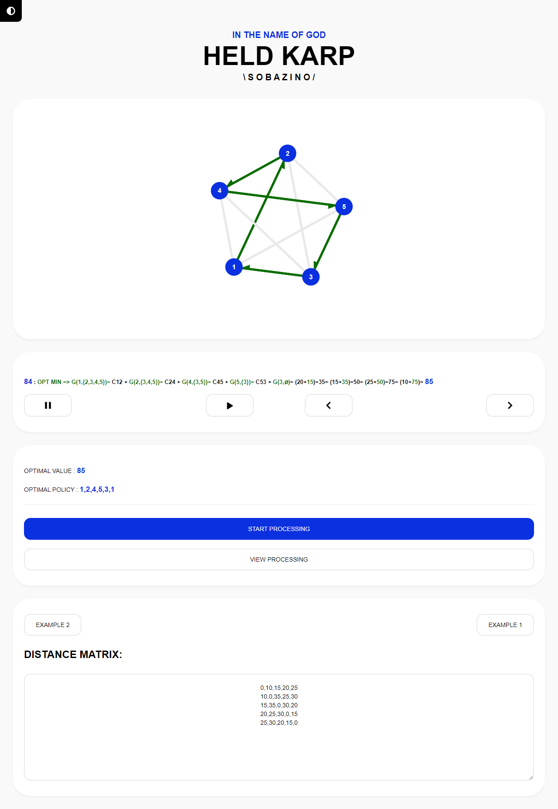

# TSP - HELD KARP

**
Ideas, feedback, and contributions to code are all very welcome.
**

 

Dynamic Programming Implementation of Travel Salesman Problem

 
The Held–Karp algorithm, also called the Bellman–Held–Karp algorithm, is a dynamic programming algorithm proposed in 1962 independently by Bellman and by Held and Karp to solve the traveling salesman problem (TSP), in which the input is a distance matrix between a set of cities, and the goal is to find a minimum-length tour that visits each city exactly once before returning to the starting point.

  

 

---

### License

TSP is licensed under the [MIT license](https://github.com/sobazino/TSP/blob/main/LICENSE).
